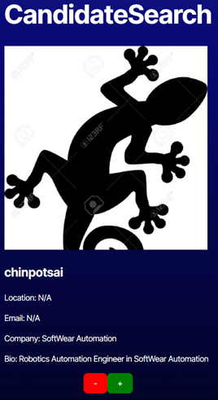
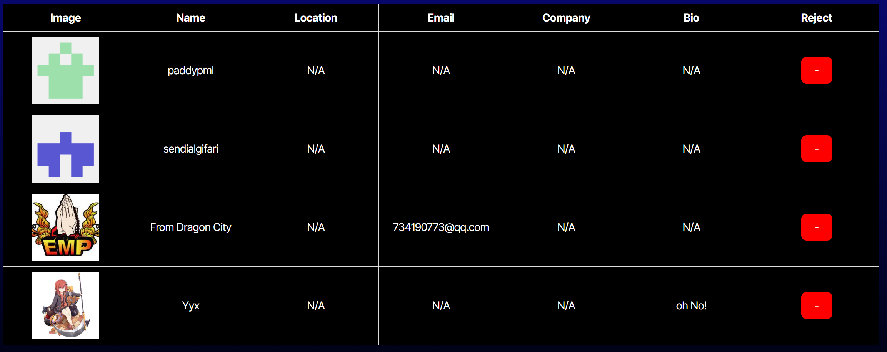

# Candidate Search

## Description

This project is a Candidate Search Application that leverages the GitHub API to fetch and display profiles as potential hiring candidates. The purpose of this application is to serve as a mock hiring platform, showcasing my programming skills in TypeScript and React. It's a fantastic way to demonstrate the practical integration of APIs, and I highly encourage others to build a similar project to practice and enhance their coding skills with TypeScript and React.

## Table of Contents

- [Installation](#installation)
- [Usage](#usage)
- [Credits](#credits)
- [License](#license)

## Installation

- Use this link [https://candidate-search-earj.onrender.com](https://candidate-search-earj.onrender.com) to get to deployed sit or if you want to use it on your own machine use following steps below (WARNING the token for this site will adventually expire when it does this website will stop working).
- copy either all the files from the repository to your computer or use your git bash terminal to clone the repository down to your own machine. 
- make sure you have [node js](https://nodejs.org/en) and the package manager that comes with it.
- run the following command in project folder terminal: "npm i" (don't include the quotation marks). This will download all the needed dependencies for the project

## Usage

- After installing the project run in the terminal for project: "npm run dev" (don't include the quotation marks). This will compile the type script files and start the project.
- The program some times will auto open the website in your browser but if not just put the following url in your browser: [http://localhost:5173/](http://localhost:5173/)
- The website has two pages the home page and the potential Candidates page to navigate between the two click the name of page at top of screen.
- When you first get to web site it start you in the home page.
- The home page will present you with a picture of a profile from github and a list of detials including the accounts owner name, location, email, company they work for and bio. Most people have alot of that info empty so if theres not a name attached to the account then There user name displays instead and if the other data fields are empty a N/A will appear instead.
- underneath all this info of the profile there is a minus and plus button.
- If you click the minus button the account will be skipped an a new account will appear.
- If you click the plus button you will also move on to the next account but the profile will be saved for the Potential Candidates page.

- On the Potential Candidate page a table of all the saved profiles will appear which each row representing a candidate.
- There table has the a column for each data field for profile plus an additional one with a minus button.
- Clicking on this button will reject the application and remove it from the table.

- If there is no candiates left on the Home page a message that there are no more will be displayed
- If there is no candiates saved on the Potential Candidates page then a message saying none have been saved yet will be displayed on that page.
- If there is no candiates saved and no candiates left on home page then the website will fetch more profiles with API and start showing them.
- For a walkthrough of how to use the application [Click Here](https://drive.google.com/file/d/1vGGjVFsZkQqwdRA3scSppThX_5ybFP99/view).

## Credits

Project Designer: Kalab Smith

## License

Distributed under the MIT License. See LICENSE.txt for more information.
